Step I - Order dedicated server

Потестувавши і покопавшись, я виявив, що Hetzner — один із найкращих сервісів серед своїх конкурентів.

* Дешева ціна на сервери
* Час up-time - 99,9%
* Легко налаштовувати


Links
|   |   |
| ------------------------------------- | ------------------------|
|Wallet    | [https://wallet.shardnet.near.org/] |
|Explorer  | [https://explorer.shardnet.near.org/] |
|Hetzner   | [https://www.hetzner.com/] |


Що нам потрібно?
| | |
| ------------------------------------- | ------------------------|
|Кредитна картка чи PayPal з грошима| 30-50 € |
|Сервер, інструкції нижче| 👇 |
|І програма віддаленого управління нашим сервером|||


|   |   |
| ------------------------------------- | ------------------------|
|MobaXterm      |  [https://mobaxterm.mobatek.net/]
|PuTTY      |- [https://www.putty.org/]

# КРОК I Реєстрація та замовлення виділеного сервера
## Для початку вам потрібно придбати сервер.

У Челленджі (005)[https://github.com/near/stakewars-iii/blob/main/challenges/005.md] ви можете вибрати один з наступних сервісів

* Amazon Web Services
* Google Cloud Platform
* Microsoft Azure
* IBM Cloud
* DigitalOcean
* Hetzner

Ми покажемо вам на прикладі (Hetzner)[https://www.hetzner.com/]

## Вимоги до сервера
1. Вибір сервера Вимоги до обладнання наведені нижче:

| ТИП | Вимога |
| ------------------------------------- | ------------------------|
|CPU | 4-ядерний процесор із підтримкою AVX | |
|RAM | 8GB DDR4 | |
|STORAGE | 500GB SSD | |

2. Зайдіть на сайт https://www.hetzner.com/ У верхній частині сайту оберіть Dedicated

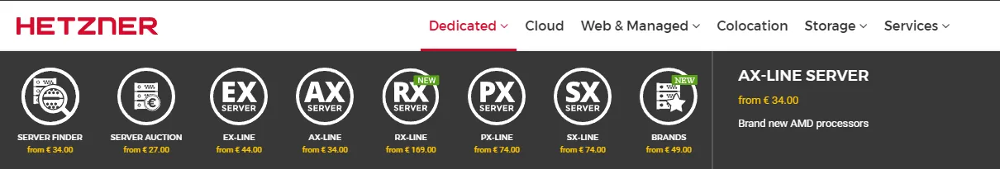

3. Натисніть на Пошук сервера і виберіть сервер, який вам подобається, але його характеристики не повинні бути нижчими за рекомендовані

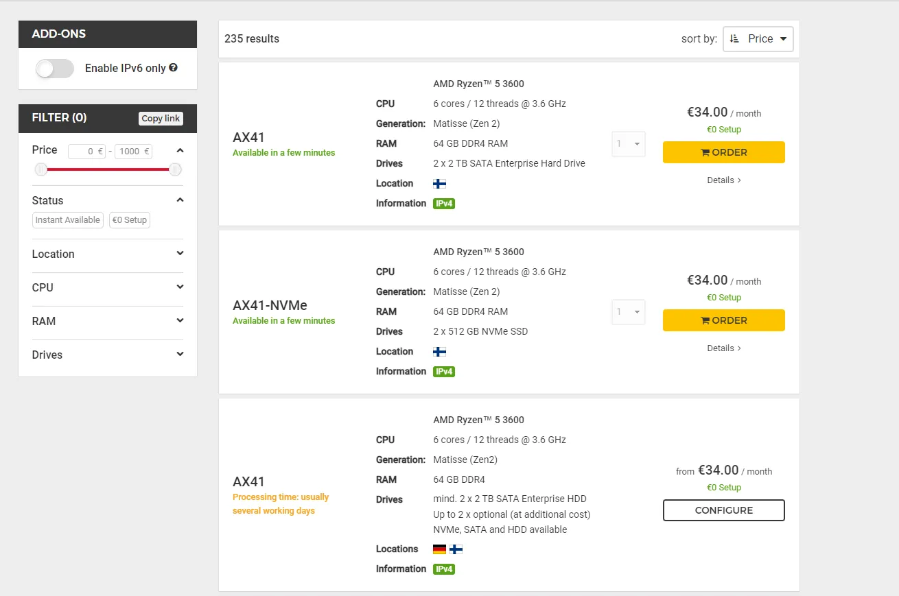


Тут ми бачимо, що другий сервер із NVMe SSD відповідає нашим вимогам до обладнання

## Давайте перейдемо до замовлення сервера на прикладі AX41-NVMe

* Натискаємо на Замовити
* Ми будемо перенаправлені на конфігурацію сервера

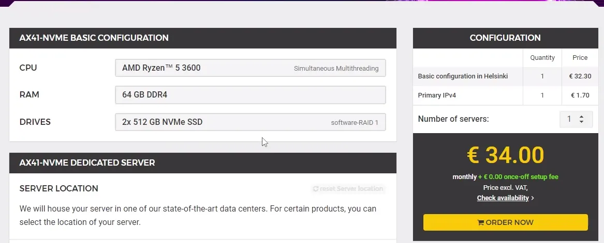

Переходимо до вибору операційної системи

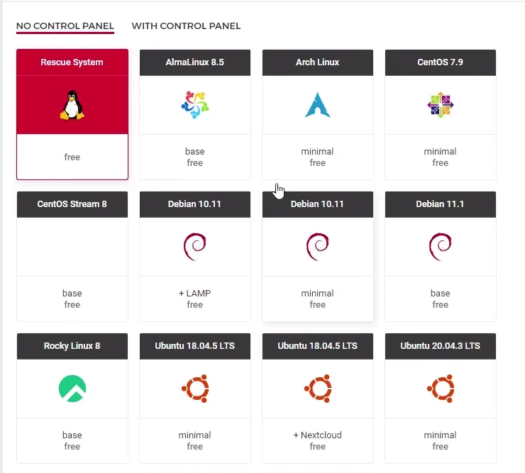


* Тут ми можемо вибрати, чи хочемо ми отримати нову операційну систему або встановити нову, вибираємо Rescue System
* Потім натисніть на Order now
* Ми будемо перенаправлені для підтвердження замовлення


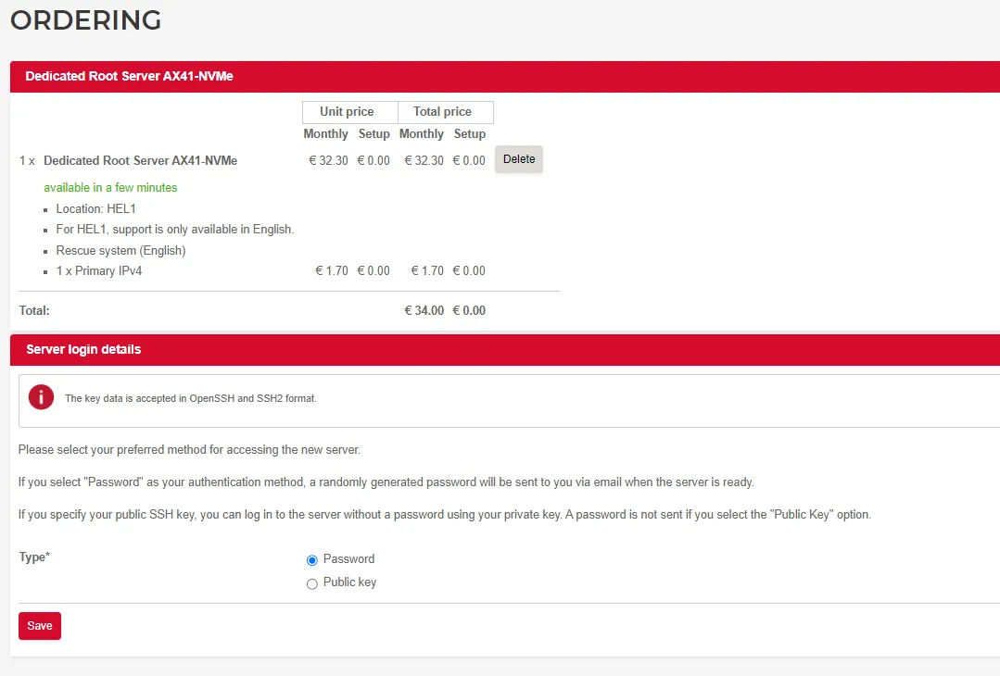


* Натисніть Зберегти


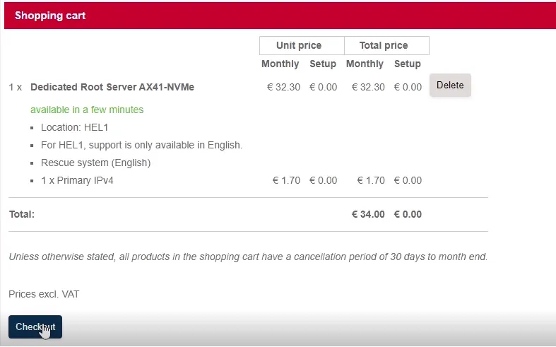


* Тут ми натискаємо на Оформити замовлення
* Потім відкриється сторінка входу в обліковий запис


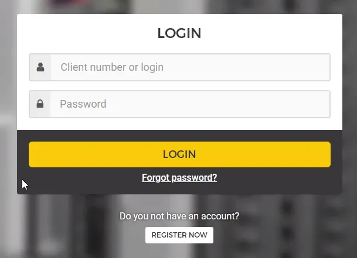


* Тут натискаємо на "Зареєструватися зараз" - якщо у вас немає облікового запису.
* Або увійти через свій акаунт

Реєстрація тут стандартна та нескладна


* Зайти до поштової скриньки


* Підтвердіть реєстрацію
* Введіть ім'я та прізвище


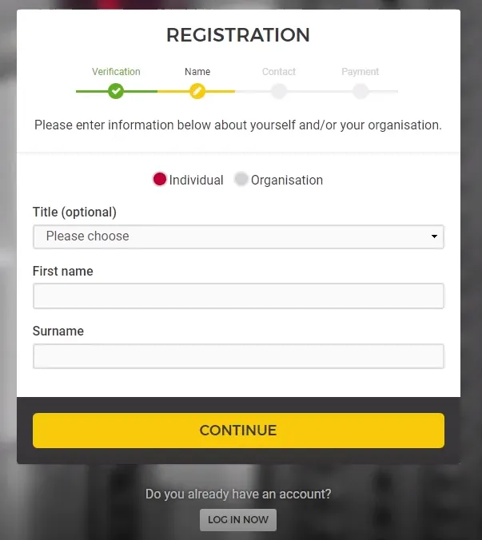


* Введіть свою контактну інформацію


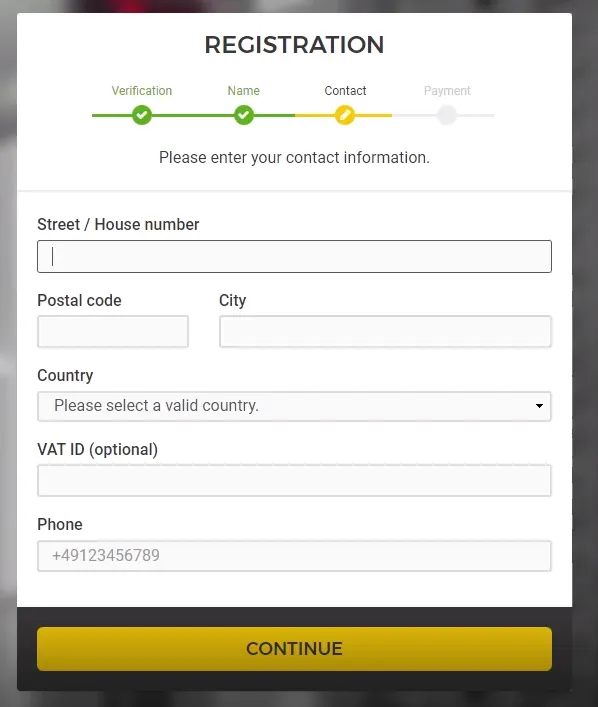


* Далі нам необхідно вибрати спосіб оплати


Тепер нам залишається тільки чекати, поки сервер з'явиться в нашому особистому кабінеті.
Зачекайте 1-10 хвилин


Тепер, коли наш сервер відображається, ми можемо розпочати встановлення ОС

Натисніть наш сервер, перейдіть на вкладку Linux і тут ви знайдете наступні репозиторії на вибір

Ми рекомендуємо дистрибутиви

* Debian 10
* Debian 11
* Ubuntu 18.04.5 Lts minimal
* Ubuntu 20.04.3 Lts minimal
* Ubuntu 22.04 Lts base


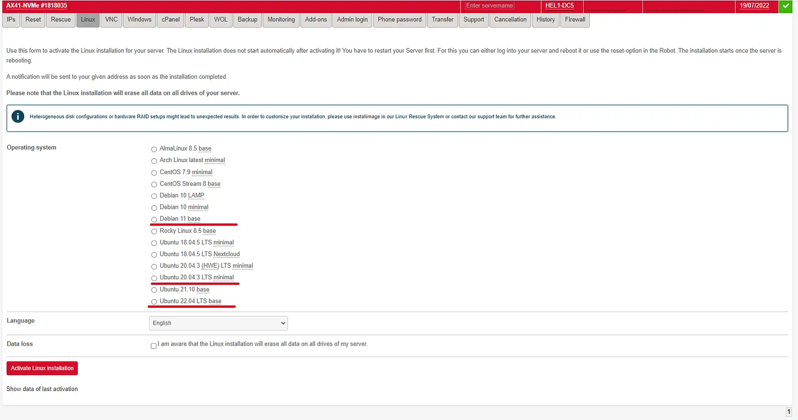


# Крок II - Створення гаманця Shardner

Ми рекомендуємо використовувати браузери, не засновані на Chromium:
Opera, Mozilla, IE

Перейдіть на [https://wallet.shardnet.near.org/] і створіть гаманець, виберіть ім'я та збережіть seed-фразу. Цей гаманець використовуватиметься для зберігання токенів NEAR.

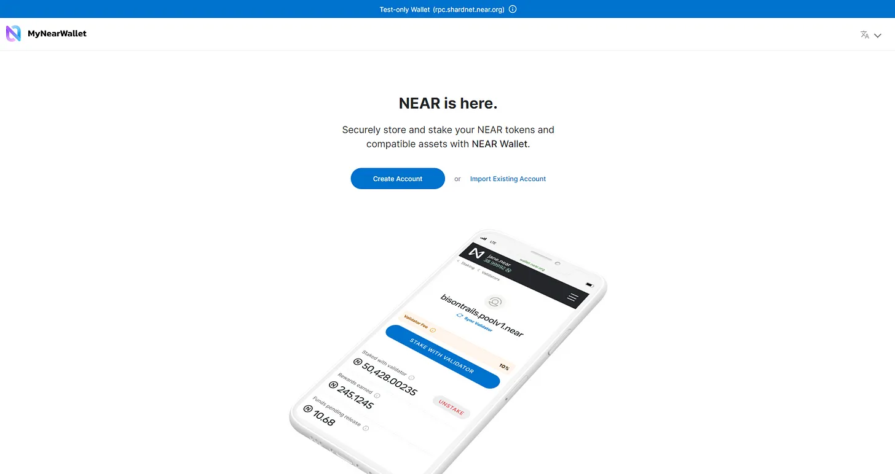


Вибираємо будь-яке ім'я гаманця

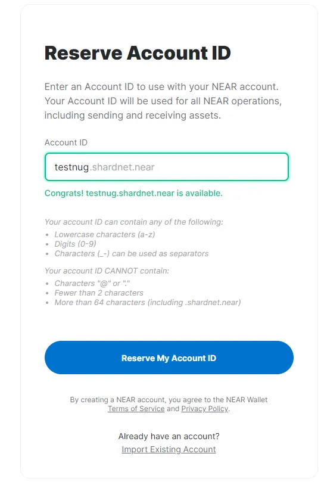


І ми маємо 500 NEAR token


# Крок III - Встановлення NEAR CLI та інструментів розробника
Підключення до сервера

Перш ніж почати, ви, можливо, захочете переконатись, що ваша машина має потрібні характеристики процесора.

```
lscpu | grep -P '(?=.*avx )(?=.*sse4.2 )(?=.*cx16 )(?=.*popcnt )' > /dev/null \
  && echo "Supported" \
  || echo "Not supported"
```
> Input
Для роботи з мережею NEAR нам потрібен інструмент. Він називається NEAR-CLI.

###### Встановіть інструменти розробника.

1. Спочатку нам потрібно переконатися, що ваша система оновлена:


```
sudo apt update && sudo apt upgrade -y
```

2. Далі встановіть
```
sudo apt install -y git binutils-dev libcurl4-openssl-dev zlib1g-dev libdw-dev libiberty-dev cmake gcc g++ python docker.io protobuf-compiler libssl-dev pkg-config clang llvm cargo
```

3. Або якщо ви отримаєте помилку

```
sudo apt install -y git binutils-dev libcurl4-openssl-dev zlib1g-dev libdw-dev libiberty-dev cmake gcc g++ docker.io protobuf-compiler libssl-dev pkg-config clang llvm cargo
```

4. Встановлення Node.js and npm
```
curl -sL https://deb.nodesource.com/setup_18.x | sudo -E bash -  
sudo apt install build-essential nodejs
PATH="$PATH"
```
5. Встановлення Python pip
```
sudo apt install python3-pip
```

6. І встановіть конфігурацію
```
USER_BASE_BIN=$(python3 -m site --user-base)/bin
export PATH="$USER_BASE_BIN:$PATH"
```

7. Встановлення Building env
```
sudo apt install clang build-essential make
```

8. Встановлення Rust & Cargo
```
curl --proto '=https' --tlsv1.2 -sSf https://sh.rustup.rs | sh
```
> Натисніть так
> Натисніть 1 та натисніть Enter


9. Налаштування середовища для роботи з Rust.
```
source $HOME/.cargo/env
```

10. NEAR-CLI
```
sudo npm install -g near-cli
```

And

```
export NEAR_ENV=shardnet
echo 'export NEAR_ENV=shardnet' >> ~/.bashrc
```

Ми готові виконати деякі команди, погляньмо, як це працює.
```
near validators current
```


## Rust встановлений, і ми готові до збирання nearcore.
1. Клонуйте репозиторій
````
git clone https://github.com/near/nearcore
cd nearcore
git fetch
git checkout 8448ad1ebf27731a43397686103aa5277e7f2fcf
````

2. Скомпілюйте останню версію nearcore. Це займе деякий час.
````
cargo build -p neard --release --features shardnet
````

3. Для нормальної роботи вузла NEAR потрібен робочий каталог та кілька конфігураційних файлів. Створіть початковий робочий каталог, виконавши команду:
````
./target/release/neard --home ~/.near init --chain-id shardnet --download-genesis
````

> Ця команда створить структуру каталогів і згенерує config.json, node_key.json та genesis.json у переданій мережі.

* config.json - Параметри конфігурації, які відповідають за те, як працюватиме вузол. У config.json міститься необхідна інформація про те, як вузол працюватиме в мережі, як спілкуватися з рівними, і як досягати консенсусу. Хоча деякі параметри налаштовуються. Як правило, валідатори вважають за краще використовувати config.json, який надається за замовчуванням.

* genesis.json - Файл з усіма даними, з якими мережа почала свою роботу в genesis. Він містить початкові рахунки, контракти, ключі доступу та інші записи, які є початковим станом блокчейна. Файл genesis.json – це моментальний знімок стану мережі у певний момент часу. Він містить контакти рахунків, баланси, активні валідатори та іншу інформацію про мережу.

* node_key.json - файл, що містить відкритий та закритий ключ для вузла. Також включає необов'язковий параметр account_id, який потрібний для запуску вузла валідатора (не розглядається у цьому документі).

* data/ - Папка, в яку вузол NEAR записуватиме свій стан.

Config.json вимагає додаткового налаштування, нам потрібно змінити два параметри boot_nodes та tracked_shards.

* Ми налаштовуватимемо його, використовуючи вже існуючий і готовий конфігураційний файл, наданий командою NEAR.
```
rm ~/.near/config.json
wget -O ~/.near/config.json https://s3-us-west-1.amazonaws.com/build.nearprotocol.com/nearcore-deploy/shardnet/config.json
```
Синхронізація вузла з нульових блоків - дуже довга операція, вузлу необхідно завантажити і підтвердити кожен блок початку блокчейна. Команда NEAR надає знімки блокчейну для прискорення синхронізації. Знімок – це вже підтверджена серія блоків із початку існування блокчейну. Тому нам потрібно просто скачати їх та помістити в каталог data/.


### Усі початкові кроки зроблено, і ми можемо запускати вузол.
```
cd nearcore
./target/release/neard --home ~/.near run
```

Або якщо ви вже в каталозі ~/nearcore
```
./target/release/neard --home ~/.near run
```
* Нам потрібно дочекатися 100% синхронізації вузла, після чого нам потрібно налаштувати вузол як валідатор. Щоб налаштувати валідатор, нам потрібно підписати транзакції, а для цього потрібний доступ до ключів гаманця.
* Ця команда покаже нам посилання для відкриття веб-браузера, де ми дозволимо копіювати ключі гаманця локально.

```
near login
```
> У терміналі з'явиться посилання, скопіюйте його та відкрийте у веб-браузері. Потім надайте повний доступ до облікового запису. Підтвердьте це, ввівши свій ID облікового запису.

* Тепер нам потрібно налаштувати ключі валідатора, ключі не існують за умовчанням, тому нам потрібно створити їх. Ми створимо їх, використовуючи наш ідентифікатор облікового запису, а потім перетворимо файл на валідну форму
```
near generate-key <account_id>cp ~/.near-credentials/shardnet/<account_id> ~/.near/validator_key.json
```
> Де validator_key.json це yourwalletname.shardnet.near


### Далі нам потрібно змінити файл validator_key.json.
```
nano ~/.near/validator_key.json
```
* Змініть "account_id" => xx.factory.shardnet.near, де xx – ім'я вашого пулу.
* Змініть private_key на secret_key

account_id це yourwalletname.factory.shardnet.near

Тепер ми маємо готовий вузол, але нам потрібно тримати термінальну сесію завжди відкритою, щоб вузол працював. Ми вирішимо цю проблему, обернувши вузол у системний сервіс, такі програми можуть працювати у фоновому режимі навіть за відсутності активних термінальних сесій.

* Відкрийте редактор для налаштування майбутнього сервісу.
```
sudo nano /etc/systemd/system/neard.service
```
Paste:
```
[Unit]
Description=NEARd Daemon Service

[Service]
Type=simple
User=root
#Group=near
WorkingDirectory=/root/.near
ExecStart=/root/nearcore/target/release/neard run
Restart=on-failure
RestartSec=30
KillSignal=SIGINT
TimeoutStopSec=45
KillMode=mixed

[Install]
WantedBy=multi-user.target
```
> Якщо ви працюєте під іншим користувачем, замініть /root/ на домашній каталог вашого користувача.

Увімкніть та запустіть службу.
```
systemctl enable neard
systemctl start neard
```
Щоб перевірити, як усе працює, ми можемо переглянути журнали. Але давайте встановимо невеликий інструмент, який дозволить нам бачити журнали із квітами.
```
sudo apt install ccze
```
Перевірте останніх 100 рядків логів.
```
journalctl -n 100 -f -u neard | ccze -A
```
1. Щоб стати валідатором, ми маємо виконати такі вимоги:
2. Вузол має бути повністю синхронізований
3. Має бути створений файл validator_key.json
4. Контракт повинен бути ініціалізований ключем public_key у файлі validator_key.json.
5. Account_id має бути встановлений на ідентифікатор контракту ставкового пулу.
6. Має бути достатньо делегацій для задоволення мінімальної ціни місця. Ціну місця можна переглянути тут.
7. Пропозиція має бути подана шляхом пінгу контракту.
8. Після прийняття пропозиції валідатор повинен почекати 2-3 епохи, щоб увійти до набору валідаторів.
9. Потрапивши в набір валідаторів, валідатор повинен виготовити понад 90% призначених блоків.

Ми вже зробили перші 3 пункти цього списку, щоб стати валідатором.


# Крок IV: Розгорніть новий стакінг-пул для валідатора.
NEAR використовує стакінг-пули із білим списком стакінг-контрактів для забезпечення безпеки коштів делегата. Стакінг-пул – це смарт-контракт, який розгортається на обліковці NEAR.

* Ця команда створить стакінг-пул із вказаним ім'ям та розгорне його на вказаному рахунку.
* factory.shardnet.near

```
near call factory.shardnet.near create_staking_pool '{"staking_pool_id": "<pool id>", "owner_id": "<accountId>", "stake_public_key": "<public key>", "reward_fee_fraction": {"numerator": 5, "denominator": 100}, "code_hash":"DD428g9eqLL8fWUxv8QSpVFzyHi1Qd16P8ephYCTmMSZ"}' --accountId="<accountId>" --amount=100 --gas=300000000000000 
```
Давайте помістимо наші дані та виконаємо команду.

* Pool ID: walletname, фабрика автоматично додає своє ім'я до цього параметра, створюючи {pool_id}.{staking_pool_factory}.
* ID власника: walletname.shardnet.near
* Відкритий ключ: Відкритий ключ у файлі validator_key.json.
* 5: Комісія, яку стягуватиме пул (наприклад, у цьому випадку 5 на 100 - це 5% від комісії).
* Id рахунки: walletname.shardnet.near (такі ж, як ID власника).

> Переконайтеся, що доступно не менше 30 NEAR, це мінімум, необхідний для зберігання. приклад : near call stake_wars_validator.factory.shardnet.near - amount 30 - accountId stakewars.shardnet.near - gas=30000000000000000

Давайте змінимо комісію винагороди на 1-100%
```
near call <pool_name> update_reward_fee_fraction '{"reward_fee_fraction": {"numerator": 1, "denominator": 100}}' --accountId <account_id> --gas=300000000000000
```
Щоб стати валідатором, нам потрібно NEAR на балансі нашого пулу про ціну місця, давайте відправимо 1000 NEAR.

```
near call <staking_pool_id> deposit_and_stake --amount <amount> --accountId <accountId> --gas=30000000000000000
```


## Інша команда
Зняти ставку ПОБЛИЗУ
Сума в yoctoNEAR.

* Виконайте таку команду, щоб скасувати ставку:
```
near call <staking_pool_id> unstake '{"amount": "<amount yoctoNEAR>"}' --accountId <accountId> --gas=300000000000000
```

* Щоб зняти все, ви можете запустити цей:
```
near call <staking_pool_id> unstake_all --accountId <accountId> --gas=300000000000000
```
* Зняти
Зняття ставок займає 2-3 епохи, після чого ви можете вийти в YoctoNEAR з пулу.
```
near call <staking_pool_id> withdraw '{"amount": "<amount yoctoNEAR>"}' --accountId <accountId> --gas=300000000000000
```
* Команда вилучити все:
```
near call <staking_pool_id> leave_all --accountId <accountId> --gas=300000000000000
```

* Пінг
Пінг надсилає нову пропозицію та оновлює баланси ставок для ваших делегатів. Кожної епохи потрібно відправляти запит ping, щоб підтримувати актуальність повідомлених винагород.
```
near call <staking_pool_id> ping '{}' --accountId <accountId> --gas=3000000000000000
```
Залишки
* Загальний баланс
```
near view <staking_pool_id> get_account_total_balance '{"account_id": "<accountId>"}'
```
* Ставлений баланс
```
near view <staking_pool_id> get_account_staked_balance '{"account_id": "<accountId>"}'
```
* Баланс без ставок
```
near view <staking_pool_id> get_account_unstaked_balance '{"account_id": "<accountId>"}'
```
* Доступно для виведення
Ви можете зняти кошти з контракту, лише якщо вони розблоковані.
```
near view <staking_pool_id> get_account_unstaked_balance '{"account_id": "<accountId>"}'
```
Призупинити / Відновити розставку
* Пауза
```
near call <staking_pool_id> pause_staking '{}' --accountId <accountId>
```
* Резюме
```
near call <staking_pool_id> resume_staking '{}' --accountId <accountId>
```
* Створіть новий файл у /home/<USER_ID>/scripts/ping.sh
```
#!/bin/sh
# Ping call to renew Proposal added to crontab

export NEAR_ENV=shardnet
export LOGS=/home/<USER_ID>/logs
export POOLID=<YOUR_POOL_ID>
export ACCOUNTID=<YOUR_ACCOUNT_ID>

echo "---" >> $LOGS/all.log
date >> $LOGS/all.log
near call $POOLID.factory.shardnet.near ping '{}' --accountId $ACCOUNTID.shardnet.near --gas=300000000000000 >> $LOGS/all.log
near proposals | grep $POOLID >> $LOGS/all.log
near validators current | grep $POOLID >> $LOGS/all.log
near validators next | grep $POOLID >> $LOGS/all.log
```
* Створіть новий crontab, який запускатиметься кожні 5 хвилин:
```
crontab -e
*/5 * * * * sh /home/<USER_ID>/scripts/ping.sh
```
* Виведіть список crontab, щоб побачити, як він працює:
```
crontab -l
```
* Перегляньте свої журнали
```
cat home/<ID_КОРИСТУВАЧА>/logs/all.log
```
> І нарешті вузол став валідатором!


