Step I - Order dedicated server

Потестировав и покопавшись, я обнаружил, что Hetzner — один из лучших сервисов среди своих конкурентов.

* Дешевая цена на серверы
* Время up-time - 99,9%
* Легко настраивать


Links
|   |   |
| ------------------------------------- | ------------------------|
|Wallet    | [https://wallet.shardnet.near.org/] |
|Explorer  | [https://explorer.shardnet.near.org/] |
|Hetzner   | [https://www.hetzner.com/] |


Что нам нужно?
| | |
| ------------------------------------- | ------------------------|
|Кредитная карта или PayPal с деньгами| 30-50€ |
|Сервер, инструкции ниже| 👇 |
|И программа для удаленного управления нашим сервером|||


|   |   |
| ------------------------------------- | ------------------------|
|MobaXterm      |  [https://mobaxterm.mobatek.net/]
|PuTTY      |- [https://www.putty.org/]

# ШАГ I Регистрация и заказ выделенного сервера
## Для начала вам нужно купить сервер.

В Челлендже (005)[https://github.com/near/stakewars-iii/blob/main/challenges/005.md] вы можете выбрать однин из следующих сервисов

* Amazon Web Services
* Google Cloud Platform
* Microsoft Azure
* IBM Cloud
* DigitalOcean
* Hetzner

Мы покажем вам на примере (Hetzner)[https://www.hetzner.com/]

## Требования к серверу
1. Выбор сервера Требования к оборудованию приведены ниже:

| ТИП | Требование |
| ------------------------------------- | ------------------------|
|CPU | 4-ядерный процессор с поддержкой AVX | |
|RAM | 8GB DDR4 | |
|STORAGE | 500GB SSD | |

2. Зайдите на сайт https://www.hetzner.com/ В верхней части сайта выберите Dedicated 

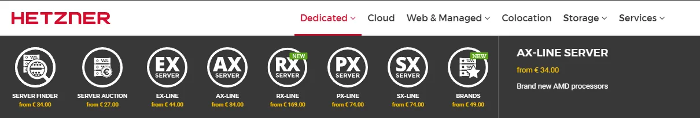

3. Нажмите на Поиск сервера и выберите сервер, который вам нравится, но его характеристики не должны быть ниже рекомендуемых

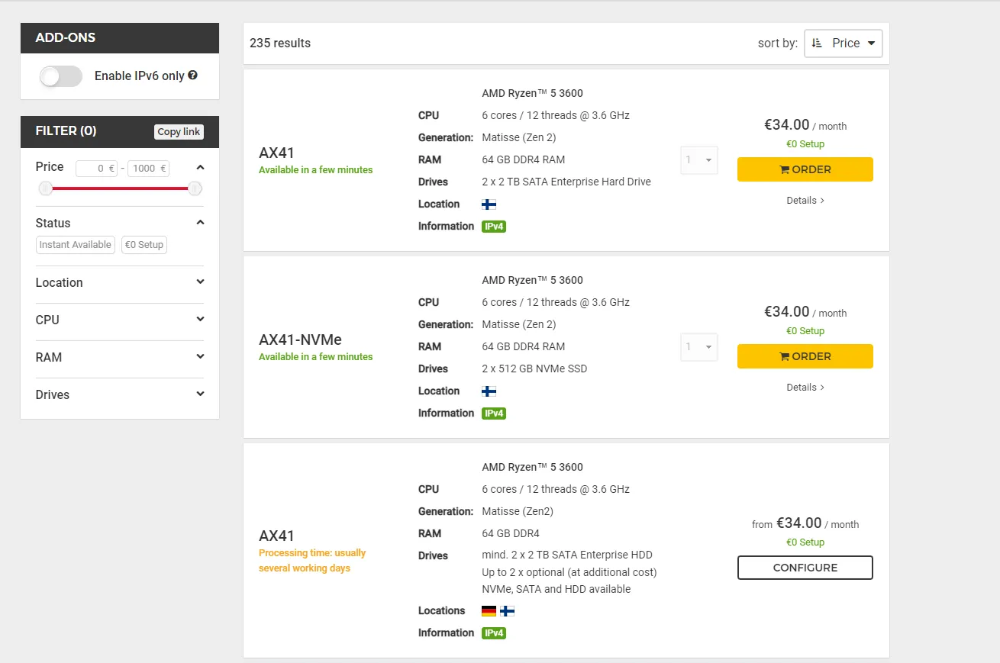


Здесь мы видим, что второй сервер с NVMe SSD соответствует нашим требованиям к оборудованию

## Давайте перейдем к заказу сервера на примере AX41-NVMe

* Нажимаем на Заказать
* Мы будем перенаправлены на конфигурацию сервера

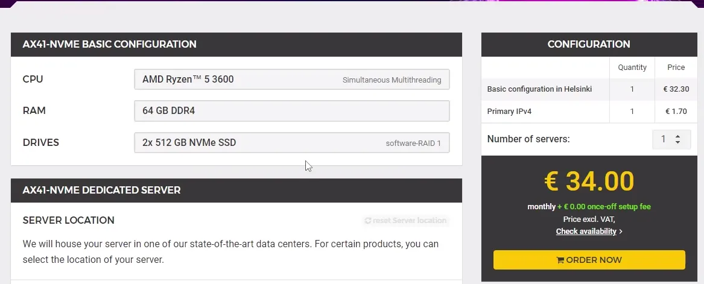

Переходим к выбору операционной системы


* Здесь мы можем выбрать, хотим ли мы получить новую операционную систему или установить новую, выбираем Rescue System
* Затем нажмите на Order now
* Мы будем перенаправлены для подтверждения заказа


* Нажмите Сохранить


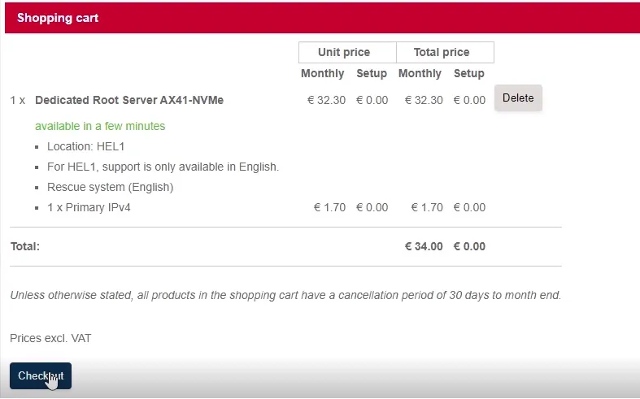


* Здесь мы нажимаем на Оформить заказ
* Затем откроется страница входа в аккаунт


* Здесь нажимаем на "Зарегистрироваться сейчас" - если у вас нет учетной записи.
* Или войти через свой аккаунт

Регистрация здесь стандартная и несложная

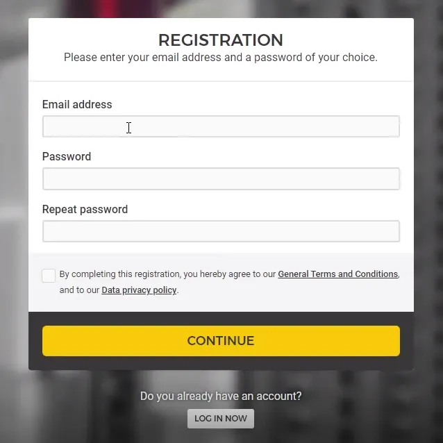


* Зайти в почтовый ящик


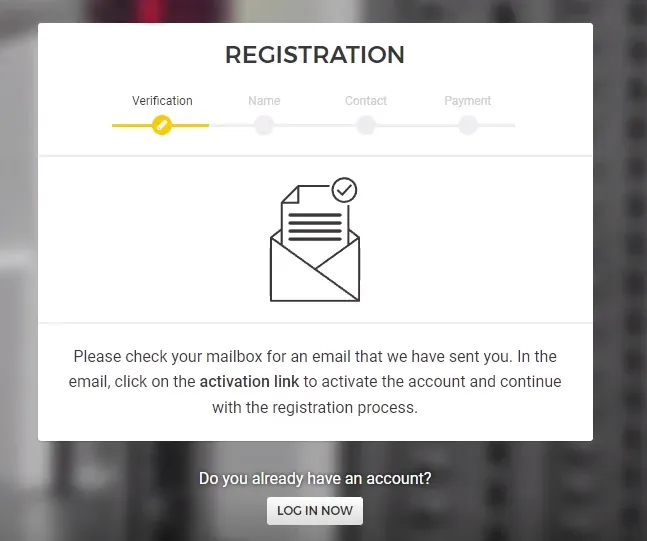


* Подтвердите регистрацию
* Введите имя и фамилию


* Введите свою контактную информацию


* Далее нам необходимо выбрать способ оплаты


## Теперь нам остается только ждать, пока сервер появится в нашем личном кабинете.
Подождите 1-10 минут


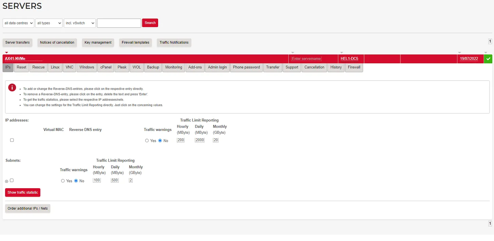


Теперь, когда наш сервер отображается, мы можем приступить к установке ОС

Нажмите на наш сервер, перейдите на вкладку Linux и здесь вы найдете следующие репозитории на выбор

Мы рекомендуем дистрибутивы

* Debian 10
* Debian 11
* Ubuntu 18.04.5 Lts minimal
* Ubuntu 20.04.3 Lts minimal
* Ubuntu 22.04 Lts base


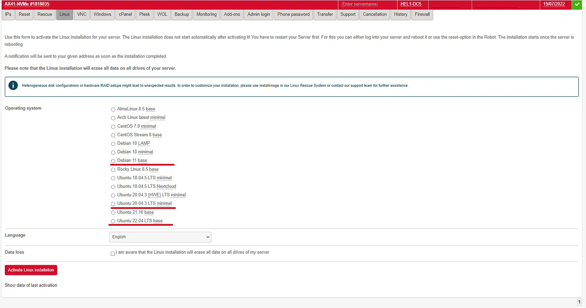


# Шаг II - Создание кошелька Shardner

Мы рекомендуем вам использовать браузеры, не основанные на Chromium:
Opera, Mozilla, IE

Перейдите на [https://wallet.shardnet.near.org/] и создайте кошелек, выберите имя и сохраните seed-фразу. Этот кошелек будет использоваться для хранения токенов NEAR.

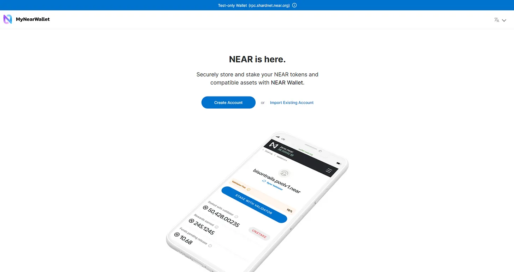


Выбираем любое име кошелька

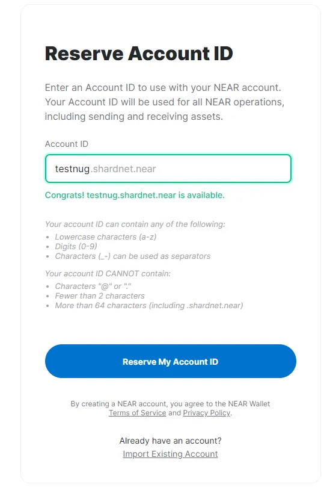


И у нас есть 500 NEAR token


# Шаг III - Установка NEAR CLI и инструментов разработчика
Подключение к вашему серверу

Прежде чем начать, вы, возможно, захотите убедиться, что ваша машина имеет нужные характеристики процессора.

```
lscpu | grep -P '(?=.*avx )(?=.*sse4.2 )(?=.*cx16 )(?=.*popcnt )' > /dev/null \
  && echo "Supported" \
  || echo "Not supported"
```
> Input
Для работы с сетью протокола NEAR нам нужен инструмент. Он называется NEAR-CLI.

###### Установите инструменты разработчика.

1. Сначала нам нужно убедиться, что ваша система обновлена:


```
sudo apt update && sudo apt upgrade -y
```

2. Далее установите
```
sudo apt install -y git binutils-dev libcurl4-openssl-dev zlib1g-dev libdw-dev libiberty-dev cmake gcc g++ python docker.io protobuf-compiler libssl-dev pkg-config clang llvm cargo
```

3. Или если вы получите ошибку

```
sudo apt install -y git binutils-dev libcurl4-openssl-dev zlib1g-dev libdw-dev libiberty-dev cmake gcc g++ docker.io protobuf-compiler libssl-dev pkg-config clang llvm cargo
```

4. Установка Node.js and npm
```
curl -sL https://deb.nodesource.com/setup_18.x | sudo -E bash -  
sudo apt install build-essential nodejs
PATH="$PATH"
```
5. Установка Python pip
```
sudo apt install python3-pip
```

6. И установите конфигурацию
```
USER_BASE_BIN=$(python3 -m site --user-base)/bin
export PATH="$USER_BASE_BIN:$PATH"
```

7. Установка Building env
```
sudo apt install clang build-essential make
```

8. Установка Rust & Cargo
```
curl --proto '=https' --tlsv1.2 -sSf https://sh.rustup.rs | sh
```
> Нажмите да
> Нажмите 1 и нажмите Enter


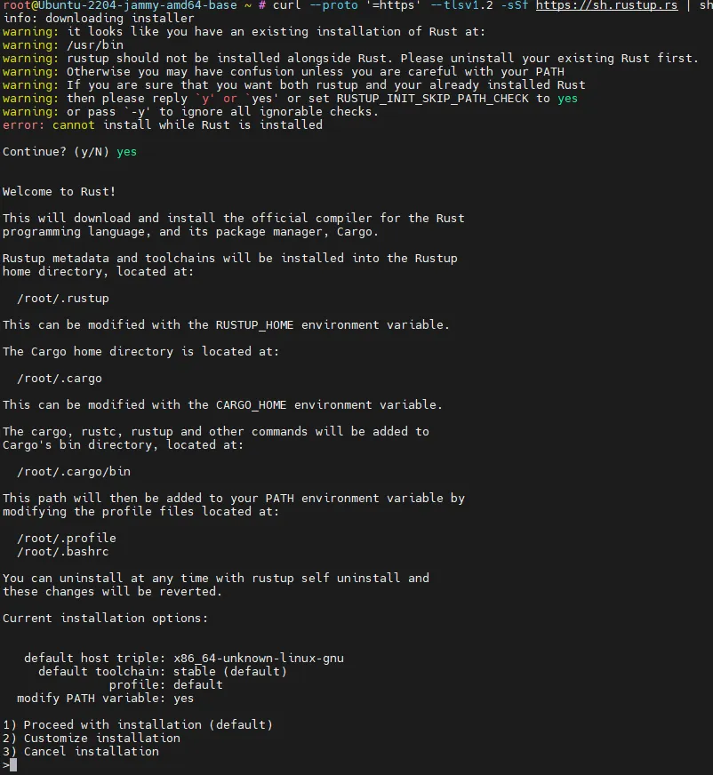


9. Настройка среды для работы с Rust.
```
source $HOME/.cargo/env
```

10. NEAR-CLI
```
sudo npm install -g near-cli
```

And

```
export NEAR_ENV=shardnet
echo 'export NEAR_ENV=shardnet' >> ~/.bashrc
```

Мы готовы выполнить некоторые команды, давайте посмотрим, как это работает.
```
near validators current
```


## Rust установлен, и мы готовы к сборке nearcore.
1. Клонируйте репозиторий
```
git clone https://github.com/near/nearcore
cd nearcore
git fetch
git checkout 8448ad1ebf27731a43397686103aa5277e7f2fcf
```

2. Скомпилируйте последнюю версию nearcore. Это займет некоторое время.
```
cargo build -p neard --release --features shardnet
```

3. Для нормальной работы узлу NEAR требуется рабочий каталог и несколько конфигурационных файлов. Создайте первоначальный требуемый рабочий каталог, выполнив команду:
```
./target/release/neard --home ~/.near init --chain-id shardnet --download-genesis
```

> Эта команда создаст структуру каталогов и сгенерирует config.json, node_key.json и genesis.json в переданной вами сети.

* config.json - Параметры конфигурации, которые отвечают за то, как будет работать узел. В config.json содержится необходимая информация о том, как узел будет работать в сети, как общаться с равными, и как достигать консенсуса. Хотя некоторые параметры настраиваются. Как правило, валидаторы предпочитают использовать config.json, предоставляемый по умолчанию.

* genesis.json - Файл со всеми данными, с которыми сеть начала свою работу в genesis. Он содержит начальные счета, контракты, ключи доступа и другие записи, которые представляют собой начальное состояние блокчейна. Файл genesis.json - это моментальный снимок состояния сети в определенный момент времени. В нем содержатся контакты счетов, балансы, активные валидаторы и другая информация о сети.

* node_key.json - файл, содержащий открытый и закрытый ключ для узла. Также включает необязательный параметр account_id, который требуется для запуска узла валидатора (не рассматривается в этом документе).

* data/ - Папка, в которую узел NEAR будет записывать свое состояние.

Config.json требует дополнительной настройки, нам нужно изменить два параметра boot_nodes и tracked_shards.

* Мы будем настраивать его, используя уже существующий и готовый конфигурационный файл, предоставленный командой NEAR.
```
rm ~/.near/config.json
wget -O ~/.near/config.json https://s3-us-west-1.amazonaws.com/build.nearprotocol.com/nearcore-deploy/shardnet/config.json
```
Синхронизация узла с нулевых блоков - очень долгая операция, узлу необходимо загрузить и подтвердить каждый блок с начала существования блокчейна. Команда NEAR предоставляет снимки блокчейна для ускорения синхронизации. Снимок - это уже подтвержденная серия блоков с начала существования блокчейна. Поэтому нам нужно просто скачать их и поместить в каталог data/.


### Все начальные шаги сделаны, и мы можем запускать узел.
```
cd nearcore
./target/release/neard --home ~/.near run
```

Или если вы уже в каталоге ~/nearcore
```
./target/release/neard --home ~/.near run
```
* Нам нужно дождаться 100% синхронизации узла, после чего нам нужно настроить узел как валидатор. Чтобы настроить валидатор, нам нужно подписать транзакции, а для этого необходим доступ к ключам кошелька.
* Эта команда покажет нам ссылку для открытия веб-браузера, где мы разрешим копировать ключи кошелька локально.

```
near login
```
> В терминале появится ссылка, скопируйте ее и откройте в веб-браузере. Затем предоставьте полный доступ к учетной записи. Подтвердите это, введя свой ID аккаунта.

* Теперь нам нужно настроить ключи валидатора, ключи не существуют по умолчанию, поэтому нам нужно их создать. Мы создадим их, используя наш идентификатор учетной записи, а затем преобразуем файл в валидную форму
```
near generate-key <account_id>cp ~/.near-credentials/shardnet/<account_id> ~/.near/validator_key.json
```
> Где validator_key.json это yourwalletname.shardnet.near


### Далее нам нужно изменить файл validator_key.json.
```
nano ~/.near/validator_key.json
```
* Измените "account_id" => xx.factory.shardnet.near, где xx - имя вашего пула.
* Измените private_key на secret_key

account_id это yourwalletname.factory.shardnet.near

Теперь у нас есть готовый узел, но нам нужно держать терминальную сессию всегда открытой, чтобы узел работал. Мы решим эту проблему, обернув узел в системный сервис, такие программы могут работать в фоновом режиме даже при отсутствии активных терминальных сессий.

* Откройте редактор для настройки будущего сервиса.
```
sudo nano /etc/systemd/system/neard.service
```
Paste:
```
[Unit]
Description=NEARd Daemon Service

[Service]
Type=simple
User=root
#Group=near
WorkingDirectory=/root/.near
ExecStart=/root/nearcore/target/release/neard run
Restart=on-failure
RestartSec=30
KillSignal=SIGINT
TimeoutStopSec=45
KillMode=mixed

[Install]
WantedBy=multi-user.target
```
> Если вы работаете под другим пользователем, то замените /root/ на домашний каталог вашего пользователя.

Включите и запустите службу.
```
systemctl enable neard
systemctl start neard
```
Чтобы проверить, как все работает, мы можем просмотреть журналы. Но давайте установим небольшой инструмент, который позволит нам видеть журналы с цветами.
```
sudo apt install ccze
```
Проверьте последние 100 строк логов.
```
journalctl -n 100 -f -u neard | ccze -A
```
1. Чтобы стать валидатором, мы должны выполнить следующие требования:
2. Узел должен быть полностью синхронизирован
3. Должен быть создан файл validator_key.json
4. Контракт должен быть инициализирован ключом public_key в файле validator_key.json.
5. Account_id должен быть установлен на идентификатор контракта ставочного пула.
6. Должно быть достаточно делегаций для удовлетворения минимальной цены места. Цену места можно посмотреть здесь.
7. Предложение должно быть подано путем пинга контракта.
8. После принятия предложения валидатор должен подождать 2-3 эпохи, чтобы войти в набор валидаторов.
9. Попав в набор валидаторов, валидатор должен произвести более 90% назначенных блоков.

Мы уже сделали первые 3 пункта из этого списка, чтобы стать валидатором.


# Шаг IV: Разверните новый стакинг-пул для вашего валидатора.
NEAR использует стакинг-пулы с белым списком стакинг-контрактов для обеспечения безопасности средств делегата. Стакинг-пул - это смарт-контракт, который развертывается на аккаунте NEAR.

* Эта команда создаст стакинг-пул с указанным именем и развернет его на указанном счете.
* factory.shardnet.near

```
near call factory.shardnet.near create_staking_pool '{"staking_pool_id": "<pool id>", "owner_id": "<accountId>", "stake_public_key": "<public key>", "reward_fee_fraction": {"numerator": 5, "denominator": 100}, "code_hash":"DD428g9eqLL8fWUxv8QSpVFzyHi1Qd16P8ephYCTmMSZ"}' --accountId="<accountId>" --amount=100 --gas=300000000000000 
```
Давайте поместим наши данные и выполним команду.

* Pool ID: walletname, фабрика автоматически добавляет свое имя к этому параметру, создавая {pool_id}.{staking_pool_factory}.
* ID владельца: walletname.shardnet.near
* Открытый ключ: Открытый ключ в вашем файле validator_key.json.
* 5: Комиссия, которую будет взимать пул (например, в данном случае 5 на 100 - это 5% от комиссии).
* Id счета: walletname.shardnet.near (такой же, как ID владельца).

> Убедитесь, что доступно не менее 30 NEAR, это минимум, необходимый для хранения. Пример : near call stake_wars_validator.factory.shardnet.near - amount 30 - accountId stakewars.shardnet.near - gas=30000000000000000

Давайте изменим комиссию вознаграждения на 1-100%
```
near call <имя_пула> update_reward_fee_fraction '{"reward_fee_fraction": {"numerator": 1, "знаменатель": 100}}' --accountId <account_id> --gas=30000000000000000
Для того, чтобы стать валидатором, нам нужно NEAR на балансе нашего пула о цене места, давайте отправим 1000 NEAR.
```
```
near call <staking_pool_id> deposit_and_stake --amount <amount> --accountId <accountId> --gas=30000000000000000
```


## Другая команда
Unstake NEAR
Amount in yoctoNEAR.

* Выполните следующую команду, чтобы Unstake:
```
near call <staking_pool_id> unstake '{"amount": "<amount yoctoNEAR>"}'' --accountId <accountId> --gas=30000000000000000
```

* Чтобы удалить все, вы можете выполнить следующее:
```
near call <staking_pool_id> unstake_all --accountId <accountId> --gas=30000000000000000
```
* Withdraw
Unstake занимает 2-3 эпохи, после этого периода вы можете вывести средства из пула в YoctoNEAR.
```
near call <staking_pool_id> withdraw '{"amount": "<amount yoctoNEAR>"}'' --accountId <accountId> --gas=30000000000000000
```
* Команда для снятия всех средств:
```
near call <staking_pool_id> withdraw_all --accountId <accountId> --gas=30000000000000000
```

* Ping
Пинг выдает новое предложение и обновляет балансы ставок для ваших делегатов. Пинг должен выполняться каждую эпоху для поддержания текущих данных о вознаграждениях.
```
near call <staking_pool_id> ping '{}' --accountId <accountId> --gas=30000000000000000
```
Балансы 
* Общий баланс
```
near view <staking_pool_id> get_account_total_balance '{"account_id": "<accountId>"}''
```
* Staked Balance
```
near view <staking_pool_id> get_account_staked_balance '{"account_id": "<accountId>"}
```
* Unstaked Balance
```
near view <staking_pool_id> get_account_unstaked_balance '{"account_id": "<accountId>"}
```
* Доступные для снятия средства
Вы можете снять средства с контракта, только если он разблокированы.
```
near view <staking_pool_id> is_account_unstaked_balance_available '{"account_id": "<accountId>"}''
```
Приостановить / возобновить ставку
* Пауза
```
near call <staking_pool_id> pause_staking '{}' --accountId <accountId>
```
* Resume
```
near call <staking_pool_id> resume_staking '{}' --accountId <accountId>
```
* Создайте новый файл на /home/<USER_ID>/scripts/ping.sh
```
#!/bin/sh
# Ping call to renew Proposal added to crontab

export NEAR_ENV=shardnet
export LOGS=/home/<USER_ID>/logs
export POOLID=<YOUR_POOL_ID>
export ACCOUNTID=<YOUR_ACCOUNT_ID>

echo "---" >> $LOGS/all.log
date >> $LOGS/all.log
near call $POOLID.factory.shardnet.near ping '{}' --accountId $ACCOUNTID.shardnet.near --gas=300000000000000 >> $LOGS/all.log
near proposals | grep $POOLID >> $LOGS/all.log
near validators current | grep $POOLID >> $LOGS/all.log
near validators next | grep $POOLID >> $LOGS/all.log

```
* Создайте новый кронтаб, запускаемый каждые 5 минут:
```
crontab -e
*/5 * * * * * sh /home/<USER_ID>/scripts/ping.sh
```
* Перечислите crontab, чтобы увидеть, что он запущен:
```
crontab -l
```
* Просмотрите свои журналы
```
cat home/<USER_ID>/logs/all.log
```
> И наконец-то node стал валидатором!


